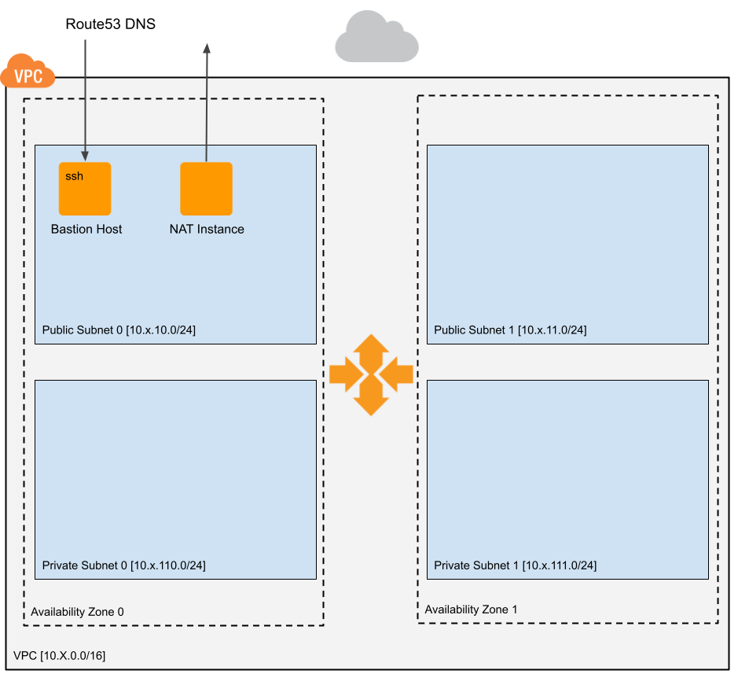

# aws-cloud-stacks

AWS CloudFormation stacks that speed-up projects development.

[](https://chrvadala.github.io)
[](https://github.com/chrvadala/aws-cloud-stacks/actions)
[](https://www.paypal.me/chrvadala/25)

# Stacks
- [Network](#Network)


## Network
This network stack is optimized for development purposes and leverages on resources that has low cost when turned off. Network stack set up the following resources:
- *VPC*
- *2 Public Subnets*
- *2 Private Subnets*
- *1 NAT Instance* that provides internet connectivity to Private Subnets. It can be powered off when private resources don't need internet access.
- *1 BastionHost* that provides SSH access to the network from any connection coming from trusted networks. It can be powered off when there aren't SSH access needs.



### Parameters
| ParameterKey           | ParameterValue                                                                                |
|------------------------|-----------------------------------------------------------------------------------------------|
| env                    | Environment type (one of dev, stg, prod)                                                      |
| space                  | Environment name                                                                              |
| cidrx                  | Number that defines the second octect of the VPC Cidr Block (10.x.0.0/16)                     |
| TrustedNetworks        | Prefix List about trusted internet subnets that can connect toward the Bastion Host           |
| BastionHostKeyName     | SSH Key that grants access to Bastion Host                                                    |
| BastionHostRoute53Zone | Route 53 Zone where the Bastion Host register its DNS public name (ex. dev-space1.domain.tld) |

### Outputs
| Output         | Export Naming Convention         | Description                      |
|----------------|----------------------------------|----------------------------------|
| Vpc            | `${env}-${space}-Vpc`            | VPC Id                           |
| VpcCidr        | `${env}-${space}-VpcCidr`        | Vpc Cidr Block (ex. 10.0.0.0/16) |
| PublicSubnet0  | `${env}-${space}-PublicSubnet0`  | Public Subnet 0 Id               |
| PrivateSubnet0 | `${env}-${space}-PrivateSubnet0` | Private Subnet 0 Id              |
| PublicSubnet1  | `${env}-${space}-PublicSubnet1`  | Public Subnet 1 Id               |
| PrivateSubnet1 | `${env}-${space}-PrivateSubnet1` | Private Subnet 1 Id              |

## Commands

### Validate stacks
```shell
./validate.sh
```

### Deploy Network Stack
```shell
  cp network.json.dist <stack-name>-network.json
  STACK=<stack-name> BUCKET=<bucket-name> ./deploy-network.sh
```

## Contributors
- [chrvadala](https://github.com/chrvadala) (author)